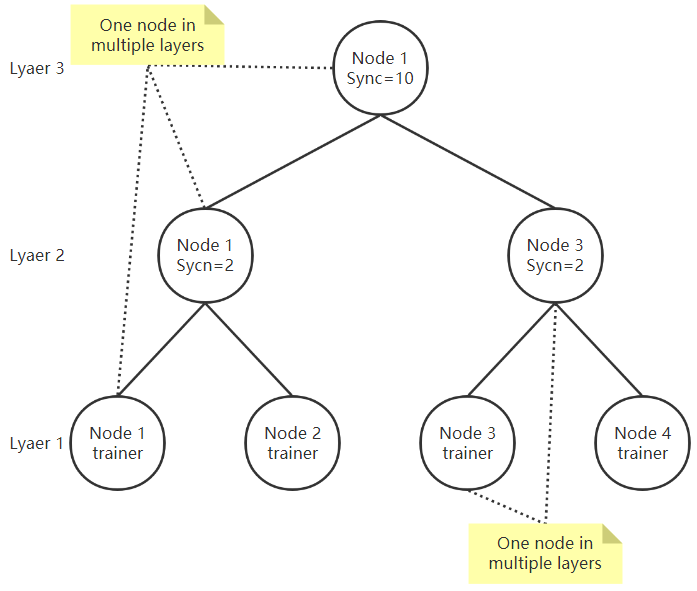

####当前env的网络结构


#### env文件说明
- id，要和该env的名字一致  
```id=1```
- 端口号，统一8888  
```port=8888```
- 类型，0=EL，1=FL  
```type=0```
- 用来将训练数据划分成一定数量的batch，正考虑换个名称  
```round=20```
- 同时处于多少层  
```layer_count=3```

- 下面都为JSON格式，key={"data":[...]}，即使节点只处于一层也要用[ ]，参考1.env
  
- 分别属于哪些层，1为最底层  
```layer={"data":[1,2,3]}```
- 节点位于每层的上层节点地址  
```up_addr={"data":["self","self","top"]}```  
当节点同时处于多层，且上层节点仍为自己时，用self代替完全的地址  
当节点处于最顶层时，该层up_addr置为top
- 节点位于每层的下层节点数量  
```down_count={"data":[0,2,2]}```  
当节点处于最底层为训练节点时，该层的down_count置为0  
- 节点位于每层的下层节点地址  
```down_addr={"data":[[],["self","http://10.0.0.2:8888"],["self","http://10.0.0.3:8888"]```  
```down_addr_host={"data":[[],["self","http://n2:8888"],["self","http://n3:8888"]```  
当节点仅仅处于最底层时可以不写down_addr  
当节点同时处于最底层和其他层时，最底层要留一个空的[ ]，参考0.env  
当节点同时处于多层，且下层节包含自己时，用self代替完全的地址
写down_addr是containernet用的，down_addr_host是docker-compose用的  
区别在于一个是containernet.py里面的ip，一个是run.yml里面的HOSTNAME  
可以只写使用到的一种
- EL中每层的同步频率  
```sync={"data":[0,2,10]}```  
当节点处于最底层为训练节点时，该层的sync置为0