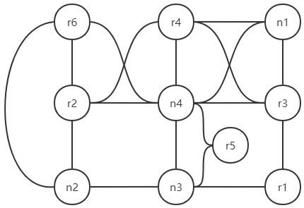

## env_addr.txt文件说明
- 服务器数量  
```"server_number": 1```  
- 外围设备数量  
```"device_number": 6```  
- 节点的部署  
```"container_number": [4]```  
例如```[4, 5, 8]```表示容器1~4部署在物理机1，容器5~5部署在物理机2，容器6~8部署在物理机3  
- 服务器ip  
```"server_ip": ['192.168.0.104']```  
顺序排列的服务器ip，一个服务器内的容器对外有一致的ip  
- 外围设备ip  
```"device_ip": {'r1': '192.168.0.108', 'r2': '192.168.0.111', 'r3': '192.168.0.103', 'r4': '192.168.0.110', 'r5': '192.168.0.113', 'r6': '192.168.0.117'}```  
name: ip  
## env_tree.txt文件说明
- etree广度优先遍历  
```
"host_list": [
	{"id": 4, "dc": 3, "layer": 3, "sync": 10},
	{"id": -4, "dc": 2, "layer": 2, "sync": 2},
	{"id": -3, "dc": 2, "layer": 2, "sync": 2},
	{"id": 3, "dc": 2, "layer": 2, "sync": 2},
	{"id": -2, "dc": 0, "layer": 1, "sync": 0},
	{"id": -6, "dc": 0, "layer": 1, "sync": 0},
	{"id": 1, "dc": 0, "layer": 1, "sync": 0},
	{"id": -1, "dc": 0, "layer": 1, "sync": 0},
	{"id": 2, "dc": 0, "layer": 1, "sync": 0},
	{"id": -5, "dc": 0, "layer": 1, "sync": 0}]
```
第一行：节点4，有3个子节点，处在第3层，聚合10次后上传（实际上是结束）  
第二行：树莓派4，有2个子节点，处在第2层，聚合2次后上传  
id为负数时表示是外围设备(r1, r2, ...)，正数表示是容器(n1, n2, ...)  
示例对应的etree网络见```etree/node/env/n_network.png```  
- 各种参数  
```"local_epoch_num": [1, 1, 1, 1, 1, 1, 1, 1, 1, 1]```  
根据id大小升序表示节点的各种参数  
从id为device_number的外围设备，到1的外围设备，到1的容器，到container_number\[-1]的容器  
\[r6, r5, r4, r3, r2, r1, n1, n2, n3, n4]  
n4、r4、r3、n3作为聚合节点不参与训练，但是learning_rate等参数也要留一个位置  
即各种参数的list长度一定要等于device_number+container_number  
- 训练数据重复使用round次  
```"round": [20, 20, 20, 20, 20, 20, 20, 20, 20, 20]```  
这个关联到上下层之间Sync，不能太小，不然可能数据用完了还没到Sync  
似乎应该为 local_epoch_num*父节点的sync*父节点的父节点的sync*…，直到最顶层  
## env_datasets.txt文件说明
- 切分数据说明

- 各种参数  
```"learning_rate": [0.05, 0.05, 0.05, 0.05, 0.05, 0.05, 0.05, 0.05, 0.05, 0.05]```  
- 训练样本范围，\[start_index, end_index]  
```"start_index": [0, 25, 50, 75, 0, 0, 0, 0, 0, 0]```  
```"end_index": [24, 49, 74, 99, 1, 1, 1, 1, 1, 1]```  
不同节点的数据集重叠在运行上不会有问题  
顺序同上  
## bw.txt文件说明
节点连接的二位矩阵，数值表示带宽，单位MB/s，inf表示和自身的连接，0表示没有连接  
顺序同上述各种参数，\[r6, r5, r4, r3, r2, r1, n1, n2, n3, n4]  

|-|r6|r5|r4|r3|r2|r1|n1|n2|n3|n4|
|---|---|---|---|---|---|---|---|---|--- |--- |
|**r6**|inf|0.0000|0.0000|0.0000|0.0266|0.0000|0.0000|0.0265|0.0000|0.0261|
|**r5**|0.0000|inf|0.0000|0.0000|0.0000|0.0000|0.0000|0.0000|0.0320|0.0405|
|**r4**|0.0000|0.0000|inf|0.0500|0.0224|0.0000|0.0454|0.0000|0.0000|0.0233|
|**r3**|0.0000|0.0000|0.0500|inf|0.0000|0.0221|0.0500|0.0000|0.0000|0.0237|
|**r2**|0.0266|0.0000|0.0224|0.0000|inf|0.0000|0.0000|0.0423|0.0000|0.0468|
|**r1**|0.0000|0.0000|0.0000|0.0221|0.0000|inf|0.0000|0.0000|0.0382|0.0000|
|**n1**|0.0000|0.0000|0.0454|0.0500|0.0000|0.0000|inf|0.0000|0.0000|0.0223|
|**n2**|0.0265|0.0000|0.0000|0.0000|0.0423|0.0000|0.0000|inf|0.0305|0.0000|
|**n3**|0.0000|0.0320|0.0000|0.0000|0.0000|0.0382|0.0000|0.0305|inf|0.0365|
|**n4**|0.0261|0.0405|0.0233|0.0237|0.0468|0.0000|0.0223|0.0000|0.0365|inf|

##示例网络结构
示例r6, r5, r4, r3, r2, r1, n1, n2, n3, n4组成的网络  
  