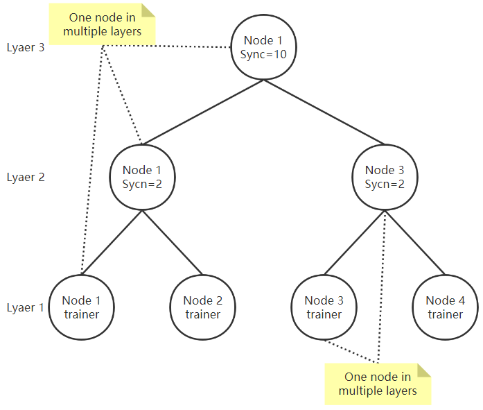

## .env文件说明，以n1.env为例
- 连接的交换机，只能有一个  
```"switch": 'http://s-etree-1:10001'```  
- 与交换机连接的带宽，MB/s  
```"bw": 0.002```
- 类型，0: EL，1: FL  
```"type": 0```  
conf_gen.py生成的默认type=0  
- 同时处于多少层  
```"layer_count": 3```

- 下面例子中使用[ ]为key值的，即使节点只处于一层也要用[ ]  

- 分别属于哪些层，1为最底层  
```"layer": [1,2,3]```  
注意，EL中节点可以同时负责训练和聚合，但FL中不要让聚合节点同时作为训练节点  
- 节点位于每层的上层节点  
```"up_host": ["self","self","top"]```  
当节点上层节点仍为自己时，该层up_host置为self  
当节点处于最顶层时，该层up_host置为top  
- 节点位于每层的下层节点数量  
```"down_count": [0,2,2]```  
当节点处于最底层为训练节点时，该层的down_count置为0  
- 节点位于每层的下层节点  
```"down_host": [[],["self","n2"],["self","n3"]]```  
即使节点只处于一层也要用[[ ]]  
- EL中每层的同步频率  
```"sync": [0,2,10]```  
当节点处于最底层为训练节点时，该层的sync置为0  
当节点处于最顶层时，该层sync控制整个训练过程的聚合次数，当最顶层达到sync次聚合后，训练结束  

- 下面的参数不是训练节点可以随便赋个值  

- 用来将训练数据划分成一定数量的batch，正考虑换个名称  
```"round": 20```  
- 本地训练次数  
```"local_epoch_num": 1```  
- 每次训练用多少个样本  
```"batch_size": 1```  
- 学习率  
```"learning_rate": 0.05```  
- 训练样本范围，[start_index, end_index)  
```"start_index": 0```  
```"end_index": 1```  
- FL聚合节点专用，每轮选多少比例的节点训练，EL中赋值为1  
```"worker_fraction: 1"```  

##示例网络结构
示例n1.env~n4.env组成的网络  
  
