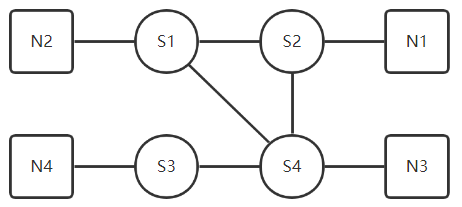

## env.txt文件说明，以s1.env为例
- 连接的交换机以及连接的带宽  
```"switch": {'http://s-etree-1:10001': 0.0020, 'http://s-etree-1:10002': 0.0020, 'http://s-etree-1:10003': 0.0020}```  
- 连接的节点以及连接的带宽  
```"node": {'http://s-etree-1:8002': 0.0020}```  
- 路由表，去往某个节点的信息应该发送到某个地址  
```
"forward":{"n1":"http://s-etree-1:10002",
"n2":"http://s-etree-1:80002",
"n3":"http://s-etree-1:10004",
"n4":"http://s-etree-1:10004"}
}
```

##示例网络结构
示例s1.env~s4.env组成的网络  
  
